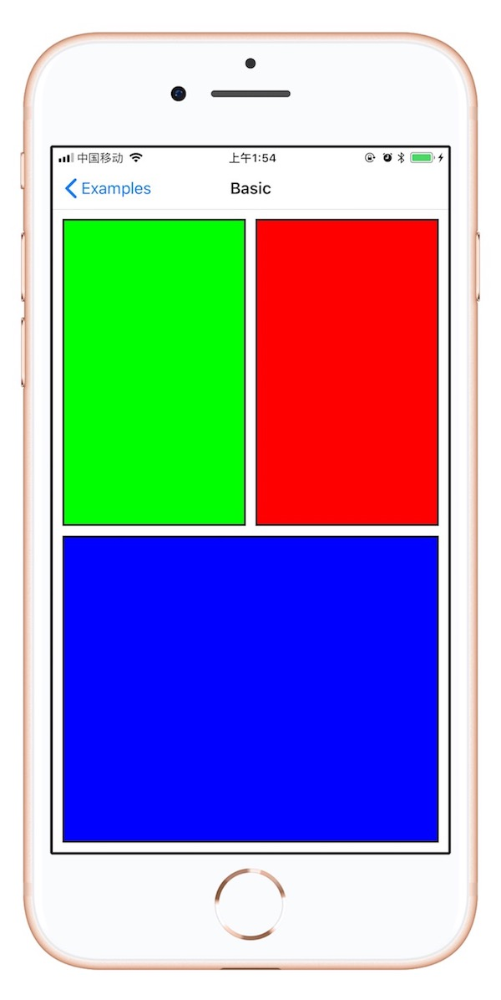
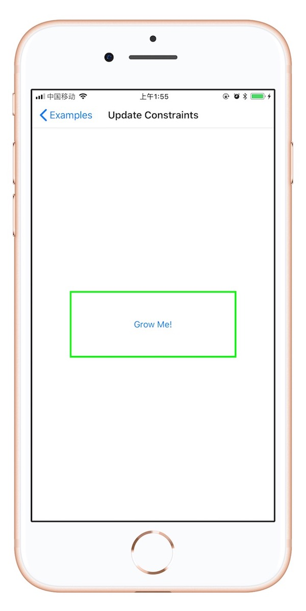

# ViewLayout

[](https://cocoapods.org/pods/ViewLayout)
[](https://cocoapods.org/pods/ViewLayout)
[](https://cocoapods.org/pods/ViewLayout)

## Installation

只需将以下行添加到您的**Podfile**

```ruby
pod 'ViewLayout'
```
## ScreenShot
<div align = "center"> 

<!---->

<!---->
</div>

## Usage & Example

在使用的文件中导入头文件

```objective-c
#import "UIView+layout.h"

```


```objective-c
[self.view addSubview:self.tableView];
[self.tableView layout_fill];
```
**LLExampleBasicView** 文件

```objective-c
[greenView layout_top:padding relation:NSLayoutRelationGreaterThanOrEqual toView:superview toAttribute:NSLayoutAttributeTop];
[greenView layout_left:padding toView:superview];
[greenView layout_bottom:-padding toView:blueView toAttribute:NSLayoutAttributeTop];
[greenView layout_right:-padding toView:redView toAttribute:NSLayoutAttributeLeft];
[greenView layout_widthEqualToView:redView];
[greenView layout_heightEqualToView:redView];
[greenView layout_heightEqualToView:blueView];

```


## License

ViewLayout is available under the MIT license. See the LICENSE file for more info.


